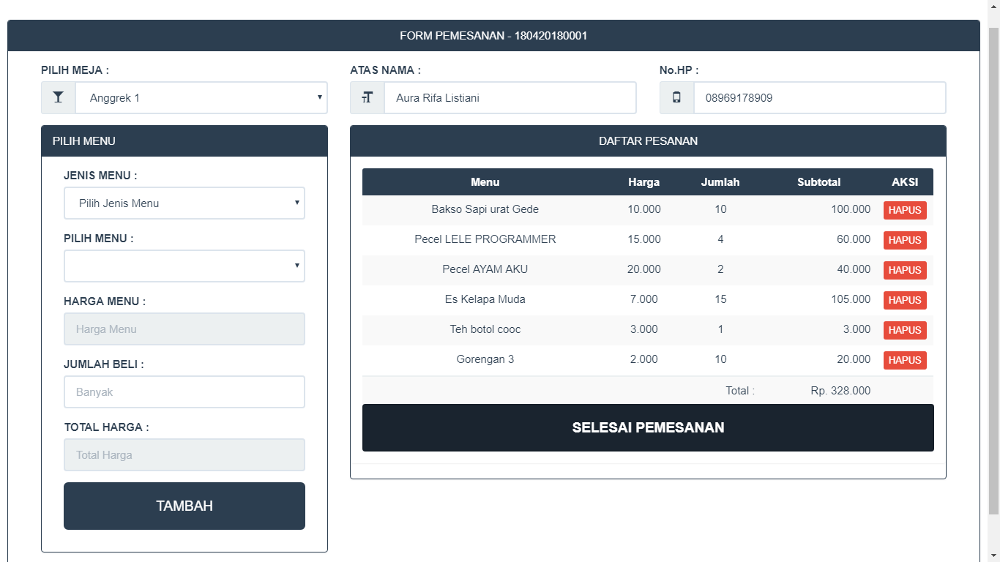
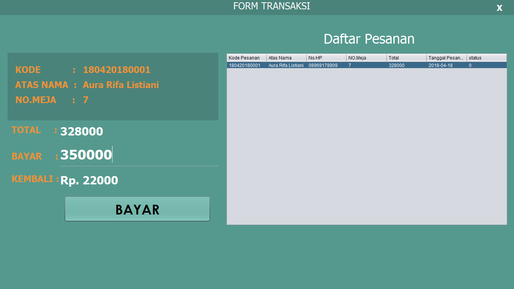

# SUDAH TIDAK MAINTENANCE

# Aplikasi Kasir Restoran Umi
Sebuah aplikasi berbasis web untuk mengelola Pemesanan dan pembayaran Restoran Umi.

## Fitur
* Pemesanan pada Web

* Pembayaran pada Desktop


## Teknologi
* PHP 5
* MySQL
* HTML
* CSS
* Javascript
* Bootstrap 
* Java

## Credit Developer
* [Email](mailto:programzidun@gmail.com) - programzidun@gmail.com
* [LinkedIn](https://www.linkedin.com/in/ramdanzidun/) - Muhammad Ramdan


```
Ku Coding Kau dengan Bismillah
```

