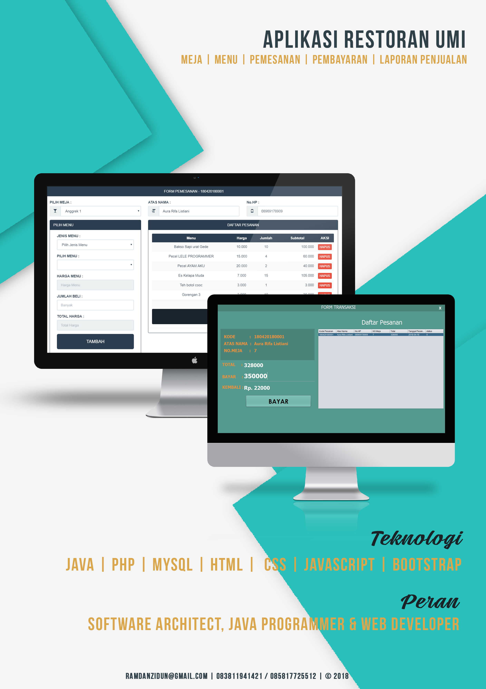

# Aplikasi Kasir Restoran Umi
Sebuah aplikasi berbasis web untuk mengelola Pemesanan dan pembayaran Restoran Umi.



## Fitur
* Pemesanan pada Web

* Pembayaran pada Desktop


## Teknologi
* PHP 5
* MySQL
* HTML
* CSS
* Javascript
* Bootstrap 
* Java

## Info Developer
Jika ada pertanyaan bisa hubungi kontak dibawah : 
* [Email](mailto:ramdanzidun@gmail.com) - ramdanzidun@gmail.com
* [LinkedIn](https://www.linkedin.com/in/rmdnzdn/) - Muhammad Ramdan
* [Instagram](https://www.instagram.com/rmdnzdn/) - @rmdnzdn


```
Ku Coding Kau dengan Bismillah
```

